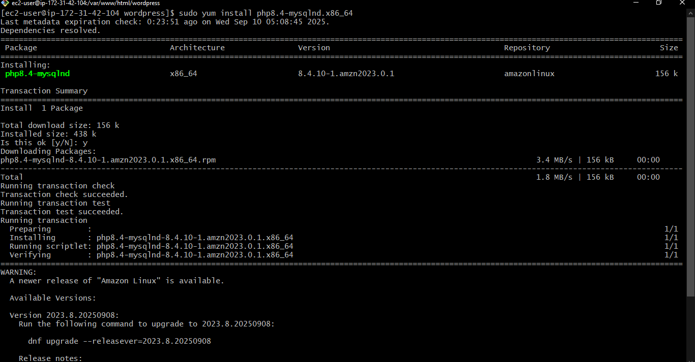

# Deployed Wordpress website on AWS EC2 Instance Using LEMP Stack

This project demonstrates how to deploy a fully functional WordPress website on an AWS EC2 instance using the LEMP stack (Linux, Nginx, MySQL, PHP). It covers everything from launching an EC2 instance to installing and configuring the necessary components, setting up the WordPress CMS, and securing the deployment. 


## What is Wordpress ?

WordPress is a free and open-source content management system (CMS) that allows users to create and manage websites, blogs, and online stores. It is highly customizable with a vast array of plugins and themes, making it easy for users to create unique and professional-looking websites without needing extensive technical skills.


## Project Objective :

- Set up and deploy a WordPress website using an AWS EC2 instance.

- Install and configure Apache, MySQL, and PHP on a Linux server.

- Download, install, and configure WordPress with a custom database and user.

- Set proper file and directory permissions for WordPress functionality.

- Configure Nginx to handle PHP using PHP-FPM and reload services.

## Prerequisites :

- Aws Acouunt
- Basic Knowledge of linux commands


### So, let's Start the Project


## Step → 1 : Sign In to Amazon Web Services Console


## Step → 2 : Create An EC2 Insatnce

In the AWS Management Console search bar, enter EC2, and click the EC2 result under Services:

#### Now, Click On → Instances → Create Instance

* Choose:
    * **AMI** → Amazon Machine Image
    * **Instane type** → Select t2.micro (free tier)
    * **Key pair** → Create or use existing one
    * **Security Group** → Allow HTTP (port 80) and SSH (port 22)
* Launch Insatnce


## Step → 3 : Conncet an Instance using SSH


```sh
ssh -i <private-key> ec2-user@<public-IP>
```


## Step → 4 : Install LEMP using script

- #### Create file → `lemp.sh`

- #### Insert the following Script


```bash
sudo yum update -y
sudo yum install nginx mariadb105-server php -y
sudo systemctl start nginx mariadb php-fpm 
sudo systemctl enable nginx mariadb php-fpm
```


- #### Change file permission

```sh
sudo chmod +x lemp.sh
```

- #### Run this file

```bash
./lemp.sh
```


## Step → 5 : Download Wordpress Application

```bash
cd /usr/share/nginx/html/
```

- #### First, download the software by running the following commands in your terminal::


```bash
sudo wget https://wordpress.org/latest.tar.gz
```


## Step → 6 : Uncompressed the Wordpress file

- #### Use this Command :

```bash
sudo tar -xvzf latest.tar.gz
```


#### You will see a tar file and a directory called WordPress with the uncompressed contents using the ls command.

- #### Delete .`gz` file using command :

```bash
sudo rm -rf latest.tar.gz
```

## Step → 7 : Install MySql Connector

```bash
sudo yum install php8.4-mysqlnd.x86_64
```





## Step → 8 : Access the Application


- #### Enter Public IP Address in web browser you should see the Wordpress welcome page.

```sh
<public-IP>/wordpress
```


## Step → 9 : Create a Database on Server


```bash
sudo mysql
```


- #### Set a password by using this command :


```bash
alter user root@localhost identified by 'root'
```


- #### Now, Create a database :

```bash
create database wordpressdb;
show databases;
```


## Step → 10 : Grant Permission to Wordpress Directory

> [!IMPORTANT]
>```bash
>sudo chmod -R 777 Wordpress/
>```


## Step → 11 : Configuration Wordpress Application


- #### Click on → Submit

- #### Run the Installation


## Step → 12 : Install Wordpress


## Step → 13 : Log In Into Wordpress


## Step → 14 : Check Details in Database

Access Database using this command and Enter Password :

```bash
sudo mysql -u root -p
use wordpress;
show tables;
```


## Step → 15 : Create a Website

- #### Click on → Add post


## Step → 16 : Publish a Blog


#### Successfully, Deployed a Wordpress Website


## Conclusion

In this project, we successfully deployed a WordPress website on an AWS EC2 instance using the LEMP stack (Linux, Nginx, MySQL, and PHP). I started by launching a server on AWS, then installed and configured all the necessary software to run WordPress.

Using the LEMP stack helped make the website fast and efficient. AWS provided a reliable and flexible cloud platform to host the site. This project helped me learn how to manage a web server, install WordPress, and understand how cloud hosting works.

Overall, it was a great hands-on experience that improved my skills in web hosting, server setup, and working with cloud services.


